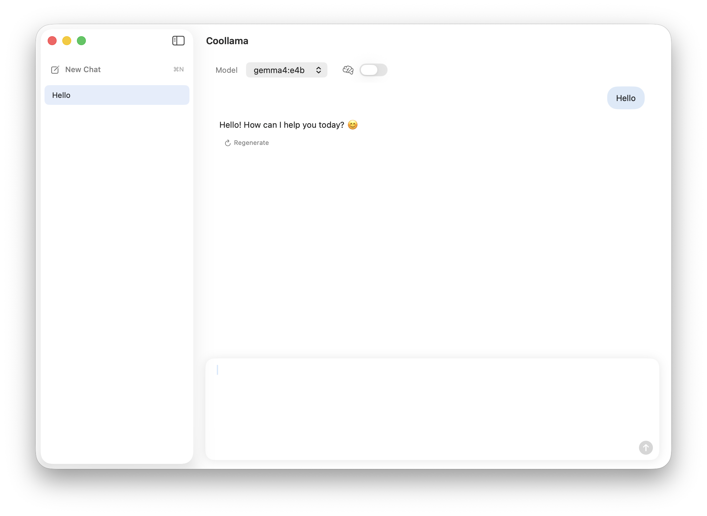
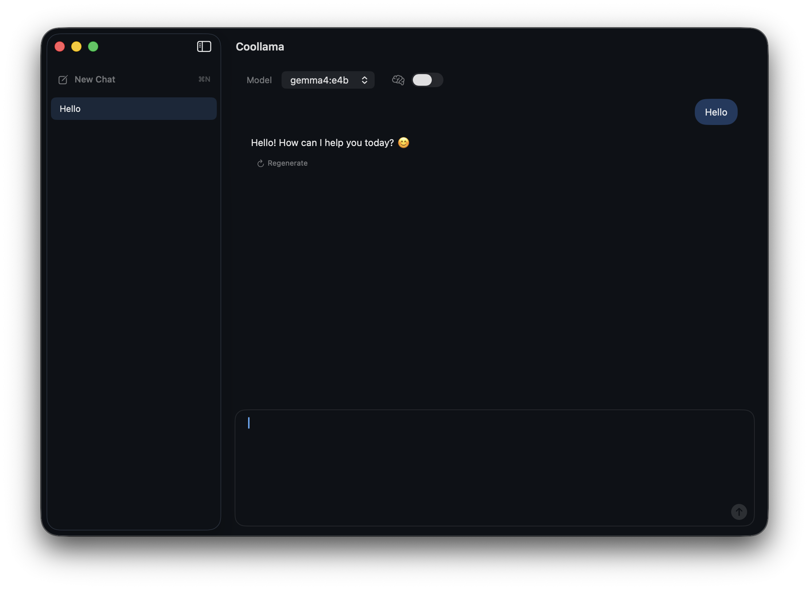

<div align="center">

# Coollama

**A native SwiftUI macOS client for your local [Ollama](https://ollama.com) models.**

[](https://www.apple.com/macos/)
[](https://swift.org)
[](https://developer.apple.com/xcode/swiftui/)
[](LICENSE)

English · [简体中文](README.zh-CN.md)

</div>

<p align="center">
  
  
</p>

---

## What Is Coollama

Coollama is a local-first desktop chat UI for Ollama. It connects directly to an Ollama service running on your Mac or local network, without cloud accounts, telemetry, or third-party analytics.

- Native macOS experience built with SwiftUI, SwiftData, and a small AppKit window chrome layer
- Lightweight codebase: no Electron, no webview, no third-party package dependency
- Privacy-first defaults: App Sandbox enabled and local-network HTTP explicitly scoped
- English by default, with an in-app language switch for Simplified Chinese

## Why Coollama

Coollama focuses on one practical gap in many Ollama desktop workflows: **thinking control**.

Some reasoning models keep thinking enabled in Ollama Desktop-style clients, and when thinking cannot be turned off, everyday short prompts can become noticeably slower. Coollama provides a dedicated **Thinking** switch for all thinking-capable models, so you can decide when reasoning is worth the extra latency and when you simply want a fast answer.

Turn thinking on for complex tasks. Turn it off for quick chats, translations, summaries, and simple coding questions.

## Features

- Fetch and switch local Ollama models from the toolbar
- Streaming chat responses with Markdown block rendering
- Thinking switch for reasoning models: freely turn thinking on or off at any time
- Thinking output display: passes Ollama's `think` parameter and shows reasoning in a collapsible section
- GPT-OSS reasoning effort picker: `low`, `medium`, `high`
- Multiple persistent chat sessions powered by SwiftData
- Stop generation while keeping the partial response marked as interrupted
- Regenerate the last assistant response
- Settings page for service URL, default model, language, appearance, and connection testing
- Light and dark themes with a minimal titlebar-free window

## Requirements

- macOS 14 Sonoma or later
- Xcode 15 or later
- [Ollama](https://ollama.com/download) running locally or on your local network
- At least one installed model, for example:
  ```bash
  ollama pull llama3.2
  ```

## Quick Start

### Build from Source

```bash
git clone https://github.com/yjj828/Coollama.git
cd coollama
open Coollama.xcodeproj
```

Select the `Coollama` scheme in Xcode and press Cmd+R.

### Build from the Command Line

```bash
xcodebuild -scheme Coollama -configuration Release build
```

The app will be built under `~/Library/Developer/Xcode/DerivedData/Coollama-*/Build/Products/Release/Coollama.app`.

## Usage

On first launch, Coollama connects to `http://127.0.0.1:11434`. If Ollama is running, your installed models will appear in the model picker.

| Shortcut | Action |
| --- | --- |
| Cmd+N | New chat |
| Cmd+, | Settings |
| Return | Send message |
| Cmd+Return / Shift+Return | Insert newline |

### Language

Coollama uses English by default. Open **Settings** → **Language** to switch to Simplified Chinese. The UI updates immediately without restarting the app.

### Remote or LAN Ollama

In **Settings** → **Service URL**, set the URL of your Ollama endpoint, for example `http://192.168.1.100:11434` or `http://gateway.local/ollama/`.

Coollama enables `NSAllowsLocalNetworking` for local-network HTTP. When the URL is not `localhost`, `127.0.0.1`, or `::1`, the settings page shows a warning that chat content will be sent in plain text to that remote host.

### Thinking Mode

| Model | Control | Behavior |
| --- | --- | --- |
| Regular models | Thinking toggle | Sends `think: true / false` |
| `gpt-oss-*` | Toggle + effort picker | Sends `think: "low" / "medium" / "high"` |

Models that support thinking will show the reasoning output above the assistant response.

## Project Structure

```text
Coollama/
├─ Models/              SwiftData models for sessions, messages, and settings
├─ Services/            Ollama HTTP client, streaming parser, localization, render cache
├─ ViewModels/          Chat, settings, focus, and language state
├─ Views/               SwiftUI views for sidebar, chat, input bar, settings, and rows
├─ Theme/               Colors, layout constants, and window chrome
├─ Assets.xcassets/     App icon and assets
├─ Info.plist
└─ Coollama.entitlements
```

## Privacy and Security

- App Sandbox is enabled.
- The app only requests `com.apple.security.network.client`.
- ATS is limited to local networking via `NSAllowsLocalNetworking`; `NSAllowsArbitraryLoads` is not enabled.
- No telemetry, crash reporting, or analytics SDK is included.
- Chat history is stored inside the app sandbox: `~/Library/Containers/com.coollama.app/Data/Library/Application Support/`.
- The settings page warns when you connect to a non-localhost service URL.

> Ollama's HTTP API is unauthenticated by default. If you expose it on your local network, protect it with a reverse proxy, TLS, Basic Auth, WireGuard, or another trusted access-control layer.

## Roadmap

- [ ] System prompt support
- [ ] Model options UI such as temperature, top_p, and num_ctx
- [ ] Chat search and tags
- [ ] Export conversations as Markdown or JSON
- [ ] Copy, delete, edit, and resend individual messages
- [ ] Move streaming decoding and rendering throttling off the main UI path
- [ ] Unit tests for `MessageContentParser`, `OllamaClient` URL handling, and localization

Issues and PRs are welcome.

## Contributing

1. Open an issue first for larger changes, especially UI or architecture changes.
2. Fork the repository and create a feature branch: `git checkout -b feat/your-change`.
3. Use [Conventional Commits](https://www.conventionalcommits.org/) when possible.
4. Make sure `xcodebuild ... build` passes before opening a PR.
5. Include screenshots or screen recordings for UI changes.

Please keep PRs focused and reviewable.

## Acknowledgements

- [Ollama](https://ollama.com) for the local LLM runtime
- [GitHub Primer](https://primer.style/) as color inspiration
- OpenAI `gpt-oss` conventions for thinking-effort levels

## License

[MIT](LICENSE) © yjj828
