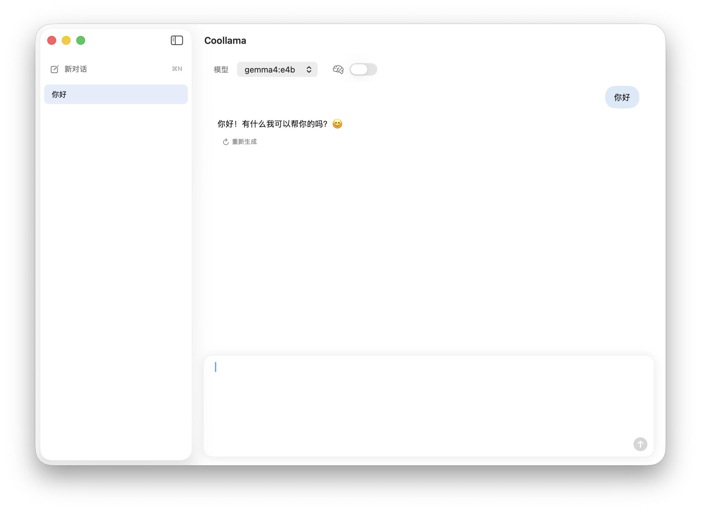
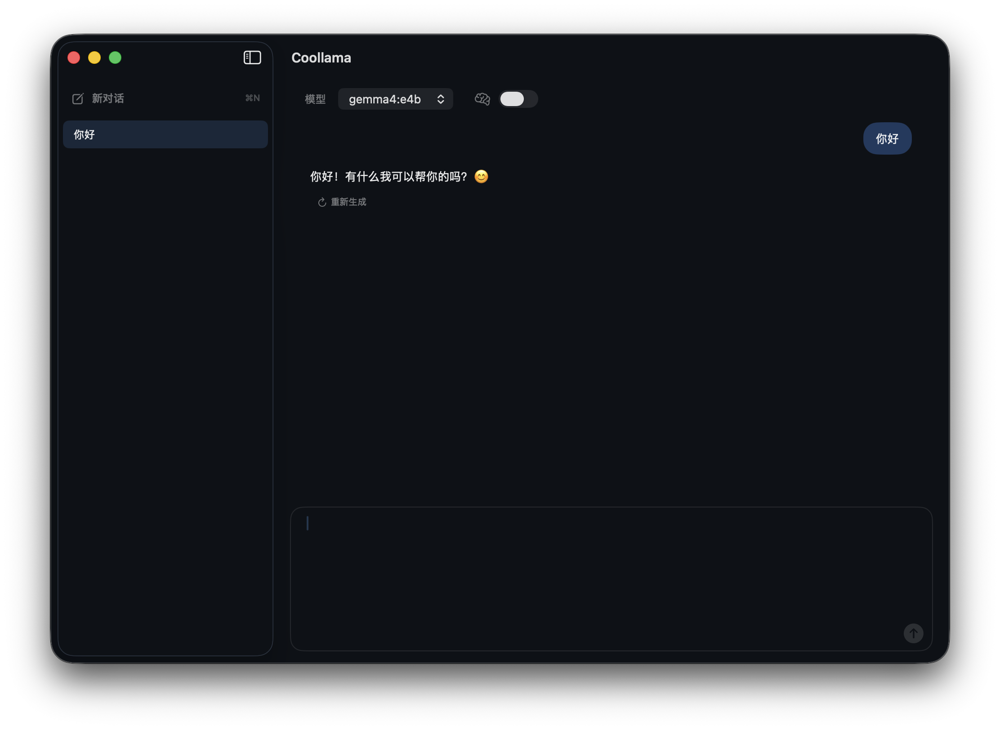

<div align="center">

# Coollama

**一个原生 SwiftUI macOS 客户端，专为本地运行的 [Ollama](https://ollama.com) 而生。**

[](https://www.apple.com/macos/)
[](https://swift.org)
[](https://developer.apple.com/xcode/swiftui/)
[](LICENSE)

[English](README.md) · 简体中文

</div>

<p align="center">
  
  
</p>

---

## 这是什么

Coollama 是一个本地优先的 Ollama 桌面聊天客户端。它直接连接运行在你的 Mac 或局域网中的 Ollama 服务，不需要云端账号，不收集遥测，也不集成第三方分析 SDK。

- 原生 macOS 体验：SwiftUI + SwiftData + 少量 AppKit 窗口外观配置
- 轻量：无 Electron、无 webview、无第三方包依赖
- 隐私优先：App Sandbox 开启，并仅显式放行本地网络 HTTP
- 默认英文，可在应用内即时切换为简体中文

## 特性

- 自动获取并切换本地 Ollama 模型
- 流式对话与 Markdown 块级渲染
- 思考模式：透传 Ollama `think` 参数，并在可折叠区域展示推理过程
- GPT-OSS 推理强度：`low`、`medium`、`high`
- 多会话持久化（SwiftData）
- 停止生成时保留已收到内容，并标记为「已中断」
- 重新生成最后一条助手回复
- 设置页：服务地址、默认模型、语言、外观、连接测试
- 浅色 / 深色主题，无边框窗口

## 系统要求

- macOS 14 Sonoma 或更高
- Xcode 15 或更高
- 本机或局域网已安装并运行 [Ollama](https://ollama.com/download)
- 至少安装过一个模型，例如：
  ```bash
  ollama pull llama3.2
  ```

## 快速开始

### 通过源码构建

```bash
git clone https://github.com/yjj828/Coollama.git
cd coollama
open Coollama.xcodeproj
```

在 Xcode 中选中 `Coollama` scheme，按 Cmd+R 运行。

### 命令行构建

```bash
xcodebuild -scheme Coollama -configuration Release build
```

构建产物位于 `~/Library/Developer/Xcode/DerivedData/Coollama-*/Build/Products/Release/Coollama.app`。

## 使用

第一次启动时，Coollama 会连接 `http://127.0.0.1:11434`。如果 Ollama 已运行，工具栏的模型选择器会显示已安装的模型。

| 快捷键 | 功能 |
| --- | --- |
| Cmd+N | 新对话 |
| Cmd+, | 设置 |
| Return | 发送消息 |
| Cmd+Return / Shift+Return | 输入换行 |

### 语言

Coollama 默认使用英文。打开 **Settings** → **Language** 可切换为简体中文，切换后界面会立即刷新，不需要重启应用。

### 远程 / 局域网 Ollama

在 **Settings** → **Service URL** 中填写 Ollama 服务地址，例如 `http://192.168.1.100:11434` 或 `http://gateway.local/ollama/`。

应用已通过 `NSAllowsLocalNetworking` 开放本地网络 HTTP。当服务地址不是 `localhost`、`127.0.0.1` 或 `::1` 时，设置页会显示一条警告，提醒你对话内容将以明文发送至远程主机。

### 思考模式

| 模型 | 控件 | 行为 |
| --- | --- | --- |
| 普通模型 | 思考开关 | 发送 `think: true / false` |
| `gpt-oss-*` | 开关 + 强度选择 | 发送 `think: "low" / "medium" / "high"` |

支持思考的模型会在助手回复上方展示推理过程。

## 项目结构

```text
Coollama/
├─ Models/              SwiftData 模型：会话、消息、设置
├─ Services/            Ollama HTTP 客户端、流式解析、本地化、渲染缓存
├─ ViewModels/          聊天、设置、焦点、语言状态
├─ Views/               侧栏、聊天、输入栏、设置页、消息行等 SwiftUI 视图
├─ Theme/               颜色、布局常量、窗口外观
├─ Assets.xcassets/     图标与资源
├─ Info.plist
└─ Coollama.entitlements
```

## 隐私与安全

- App Sandbox 已开启。
- 应用仅请求 `com.apple.security.network.client`。
- ATS 仅通过 `NSAllowsLocalNetworking` 放行本地网络；未开启 `NSAllowsArbitraryLoads`。
- 不集成遥测、崩溃上报或分析 SDK。
- 会话历史存储在应用沙盒内：`~/Library/Containers/com.coollama.app/Data/Library/Application Support/`。
- 连接非本机服务地址时，设置页会显式警告。

> Ollama 的 HTTP API 默认无鉴权。如果你把服务暴露在局域网，请自行使用反向代理、TLS、Basic Auth、WireGuard 或其他可信访问控制方式保护它。

## 路线图

- [ ] 系统提示词（System Prompt）支持
- [ ] 模型参数 UI，例如 temperature、top_p、num_ctx
- [ ] 会话搜索与标签
- [ ] 导出会话为 Markdown 或 JSON
- [ ] 单条消息复制、删除、编辑、重发
- [ ] 将流式解码与渲染节流移出主 UI 路径
- [ ] 为 `MessageContentParser`、`OllamaClient` URL 拼接、本地化逻辑补充单元测试

欢迎提交 issue 和 PR。

## 贡献

1. 较大的改动请先开 issue 讨论，尤其是 UI 或架构相关改动。
2. Fork 仓库并创建分支：`git checkout -b feat/your-change`。
3. 尽量使用 [Conventional Commits](https://www.conventionalcommits.org/)。
4. 提交 PR 前请确保 `xcodebuild ... build` 通过。
5. UI 改动请附截图或录屏。

请尽量保持 PR 聚焦、易 review。

## 致谢

- [Ollama](https://ollama.com) — 本地 LLM 运行时
- [GitHub Primer](https://primer.style/) — 配色灵感
- OpenAI `gpt-oss` 规范 — 思考强度分级参考

## 许可证

[MIT](LICENSE) © yjj828
